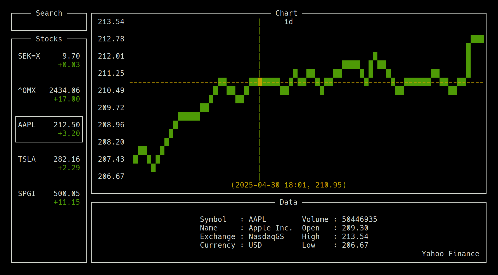
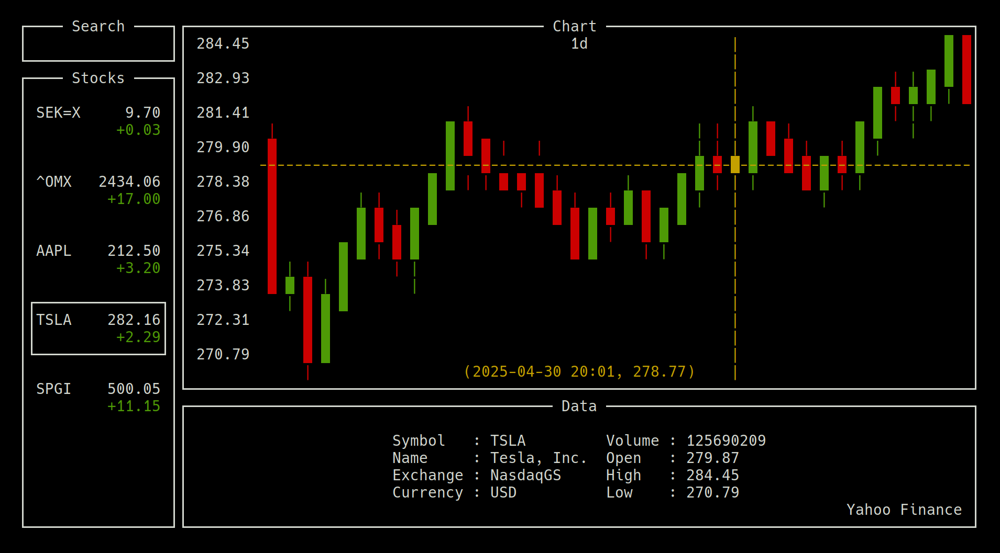
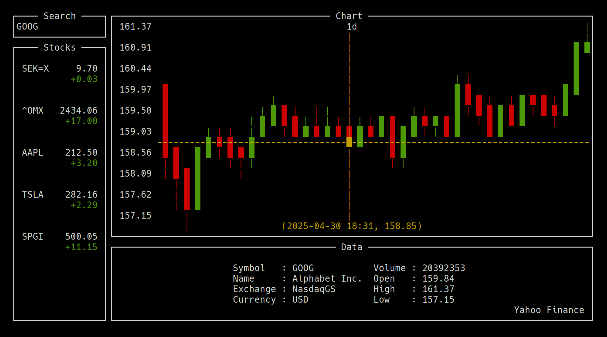

# stocks - stock monitor



*stocks* is a stock monitor with a terminal user interface. You can choose stocks and view their charts and stats. The stocks are retrieved from [Yahoo Finance](https://finance.yahoo.com/) using their API. Therefore, which stocks are available depends on which stocks Yahoo Finance shares.

By default, the chart will show the price movement of a stock today. To view the graph of a longer time period, just press the letter of the period you want, **d** for <ins>d</ins>ay, **w** for <ins>w</ins>eek, **m** for <ins>m</ins>onth, **y** for <ins>y</ins>ear, and finally, **x** for ma<ins>x</ins>, which shows the price over the stock's lifetime. Regardless which time period you are viewing, the graph will be stretched to fit exactly the width of the chart window. This means that what you see at the beginning of the graph is the price at the beginning of the period. What you see at the end of the graph is always the current price.

When viewing the chart, the cursor will start at the current price. By pressing the **left** and **right** **arrow** keys, you can move the cursor back in time or forward in time. The cursor will always remain on the graph, showing you the *closing price* at every timestamp.

The horizontal line of the cursor show you the price to the left. From the prices to the left, you can also see the high and the low prices of the current period. Often, the price at the cursor's horizontal line isn't the exact price of the current timestamp. The exact price of the current timestamp is therefore visable just beneath the chart.



In true finance spirit, you can not only view normal line charts, but also candlestick charts. To switch between line chart and candlestick chart, press **space**.

The candles show the high, open, close and low prices at each timestamp. The **high** price is always at the **top** of the candle, either wick or body. The **low** price is always at the **bottom** of the candle, either wick or body. For a *bullish* (green) candle, the **open** price is at the **bottom** of the body and the **close** price is at the top of the body. For a *bearish* (red) candle, the **open** price is at the **top** of the body and the **close** price is at the **bottom** of the body.



You are not limited to monitor the listed stocks, you can also *search* for which stock you want to view by typing the stock symbol in the search window. If you start typing when the cursor is in the list of stocks, the cursor will automatically jump to the search window. When you hit **enter**, the chart of the stock will appear. If not, either the stock symbol doesn't exist, or the stock is not available from Yahoo Finance.

If you want to view the chart in more detail, you can make the resolution of the window higher, by pressing **CTRL `+`**. To make the resolution lower, you press **CTRL `-`**. There is no *fullscreen* mode for now.

## Install

To install *stocks*, first install the necessary apt packages. Curl and JSON is needed for retrieving the data from Yahoo Finance. Ncurses is the library used to create the terminal user interface.

```bash
sudo apt install libjson-c-dev libcurl4-openssl-dev libncurses-dev
```

After installing the apt packages, you can make the *stocks* program using the makefile.

```bash
make
```

Now, the **stocks** program is available as an executable program, only accessable from this repo. If you want to make it accessable from anywhere on the computer, you can add the path to this repo in your `.bashrc` and resource it.

Alternetivly, you can create a desktop application by filling in the full path to this repo in the `stocks.desktop` file and add it to `~/.local/share/applications/` for the local user, or `/usr/share/applications/` for all users. Either copy the file into one of these directories or create a symlink with:

```bash
ln -s stocks.desktop ~/.local/share/applications/
```

## Libraries

The core libraries that is being used are [json-c](https://github.com/json-c/json-c), [curl](https://curl.se/libcurl/c/) and [ncurses](https://www.man7.org/linux/man-pages/man3/ncurses.3x.html).

For the terminal user interface I have written my own header library called [tui.h](https://github.com/hfridholm/stocks/blob/master/tui.h), which is based on ncurses. This library lets you create and manage windows in relation to each other to create what ever terminal user interface you want.

For the stocks I have written a header library called [stock.h](https://github.com/hfridholm/stocks/blob/master/stock.h), which used json-c and curl to retrieve data from Yahoo Finance's API and store the stock data in a C struct object. This makes it easy to handle stock data in a C program.
